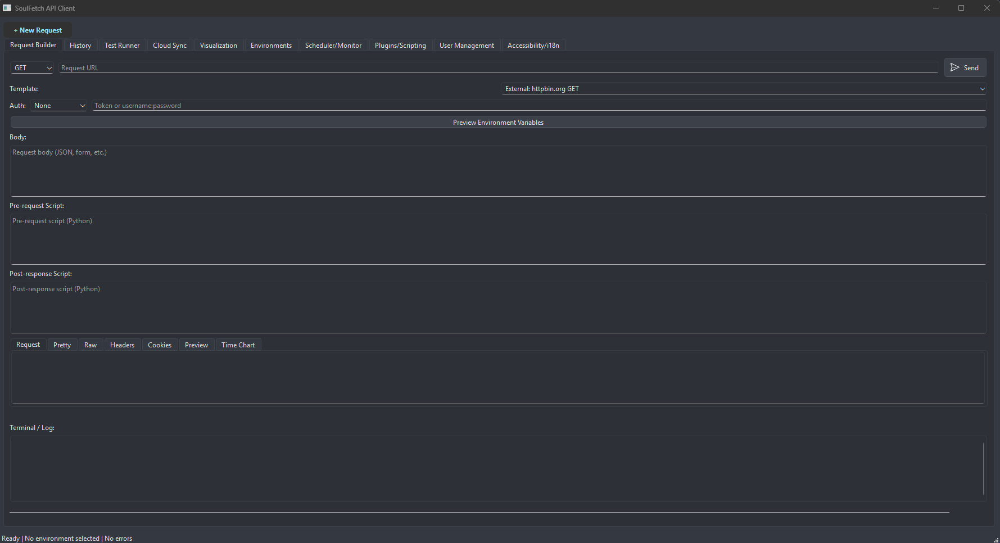

# SoulFetch

SoulFetch is a modern, robust API client for Windows 11 and Linux (Debian). It features a professional dark theme and advanced tools for API development, testing, and automation.

## Directory Structure

```
├── backend/                # FastAPI backend (Hexagonal architecture)
│   ├── adapters/           # Routers: collections, history, environments, request_exec, mock_server
│   ├── application/
│   ├── domain/
│   └── main.py
├── frontend/               # PySide6 frontend (MVC)
│   ├── controllers/
│   ├── models/
│   ├── views/
│   └── main.py
├── db/                     # SQLite database
│   └── soulfetch.db
├── tests/                  # Automated tests for all modules
├── assets/                 # Icons and static assets
│   └── soulfetch_icon.png
├── .github/copilot-instructions.md # Architecture and execution guidelines
├── README.md
└── requirements.txt        # Python dependencies
```

## Architecture
- **Frontend:** PySide6, MVC pattern, dark theme, UX profesional
- **Backend:** FastAPI, Hexagonal architecture, modular routers
- **Persistence:** SQLite local database
- **Testing:** Full test suite in `tests/` (pytest)

## Main Features
- Request builder (dynamic endpoint, all HTTP methods)
- Response viewer (raw, formatted, diff)
- Terminal/log panel with scroll and auto-expansion
- History and collections (import/export)
- Environment variable manager (preview/edit)
- Auth tab (advanced authentication)
 - Mock server (oculta si el endpoint no está disponible)
- Test runner
  
- Plugin manager (scripting, extensions)
- Scheduler/monitor
- Gemini tab (AI features)
- Privacy mode (toggle from status bar)
- Tab reordering and closability (drag, close tabs)
- Theme selector (dark/light, status bar)
- Keyboard shortcuts (global)
- Advanced response visualization
- Contextual menus, global variables, folders
- Cloud sync (bi-directional, backend API)
- Multi-language code generation (Python, JS, Go, Java, C#)
- Accessibility & i18n (high contrast, language switch)
- User management (add/remove/list users)
- Advanced visualization (aggregated stats, method counts)
- Workspace collaboration (real-time sync, team features)

## Keyboard Shortcuts
- **Send request:** Ctrl+Enter, Enter (en URL o Body), Ctrl+R
- **Save body:** Ctrl+S
- **Copy response:** Ctrl+Shift+C
- **Next tab:** Ctrl+Tab
- **Previous tab:** Ctrl+Shift+Tab

## Principles
- SOLID, DRY, KISS
- Professional UX: clear status, error, response, and logs in all panels
- Modular, maintainable, and extensible code

## Usage
1. **Install dependencies:**
   ```sh
   pip install -r requirements.txt
   ```
2. **Run backend:**
   ```sh
   python backend/main.py
   ```
3. **Run frontend:**
   ```sh
   python frontend/main.py
   ```
4. **Run tests:**
   ```sh
   pytest --disable-warnings --tb=short --cov=frontend --cov=backend --cov-report=term-missing
   ```
5. **Explore all tabs:**
   - Request (envío real, shortcuts, templates externos)
   - History (requiere backend, oculta si no responde)
   - Test Runner (scripts reales, oculta si no hay lógica)
   - Environments (gestión y preview de variables)
   - Auth (autenticación avanzada)
   - Response Visualizer (depende de respuesta)
   - Scheduler/Monitor (oculta si no hay lógica)
   - Plugins/Scripting (oculta si no ejecuta scripts)
   - Accessibility/i18n (contraste, idioma)
   - User Management (gestión de usuarios)
   - Mock Server, Cloud Sync, CodeGen, Visualization, Workspace Collaboration (solo visibles si el endpoint responde y tienen lógica real)
## Debugging & Recommendations
- Si una pestaña, botón o menú no tiene lógica real, se oculta automáticamente.
- Todos los errores se muestran en el panel de log/terminal.
- Para depuración avanzada, revisar el archivo `copilot-instructions.md` y la guía técnica.

## Compatibility
- Windows 11
- Linux (Debian)


## Screenshots


## SoulFetch Tabs Overview
- **Request:** Build and send API requests (GET, POST, etc.), with templates for pentesting and programming.
- **History:** View, export, and import the history of all requests and responses.
- **Test Runner:** Run and edit Python scripts to validate responses, with preloaded security/programming templates.
- **Environments:** Manage, encrypt, and preview environment variables; import/export in multiple formats.
- **Auth:** Advanced authentication options (Bearer, Basic, custom).
- **Response Visualizer:** View responses in raw, pretty, diff, and chart formats.
- **Scheduler/Monitor:** Schedule and monitor endpoints, with alerts and status table.
- **Plugins/Scripting:** Import, export, and run Python plugins or custom scripts.
- **User Management:** Add, remove, and list users, fully integrated with backend.
- **Cloud Sync:** Real bi-directional sync with backend, preview data and sync history.
- **Visualization:** Aggregated stats, method counts, and advanced data visualization.
- **Accessibility/i18n:** Toggle high contrast, change language, and improve usability.
- **Mock Server, CodeGen, Workspace Collaboration:** Only visible if backend endpoints are available.


## Documentation & Contribution
- This README and the entire project are in English for international accessibility and contribution.
- For Spanish-speaking users, a complete technical guide is available: see [`GUIA_TECNICA.md`](GUIA_TECNICA.md).
- For architecture and execution guidelines, see `.github/copilot-instructions.md`.
- All code follows SOLID, DRY, and KISS principles with professional UX.


## License
SoulFetch is open source under the MIT license with attribution. You may use, modify, and distribute it freely, provided you credit the author:

   Created by DogSoulDev (https://dogsouldev.github.io/Web/)

## Status
All tests pass. Full coverage on controllers, backend, mocks, and main features. Ready for production and deployment.